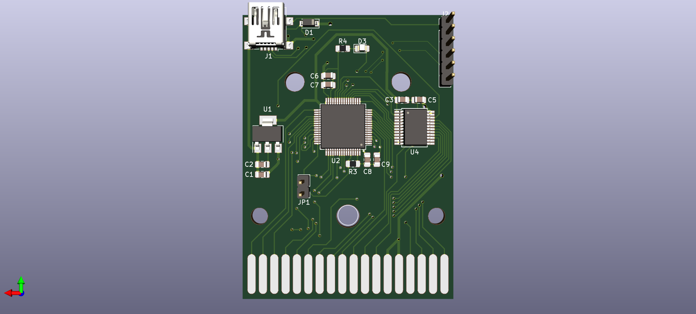
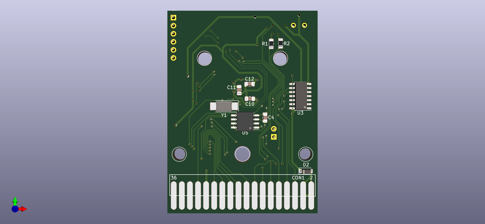

Flashable USB Vectrex Cart
==========================

Based on [FrankBuss/bloxorz](https://github.com/FrankBuss/bloxorz)'s kicad PCB design (cart pins, edge cuts, case holes, mostly)

This is an attempt to recreate the work of [SpritesMods](http://spritesmods.com/?art=veccart&page=1)'s reflashable Vectrex cart. He posted the code and lots of screens of the PCB/initial schematic, but he never released the PCB. Once recreated, it looks like a good base for cheaper multicart, and programmers cart.

3D Renders
==========

BOM
===

All the parts are described in 

Also, you can use this [digikey shared cart](https://www.digikey.com/short/phj9qt) if you're in a hurry.
