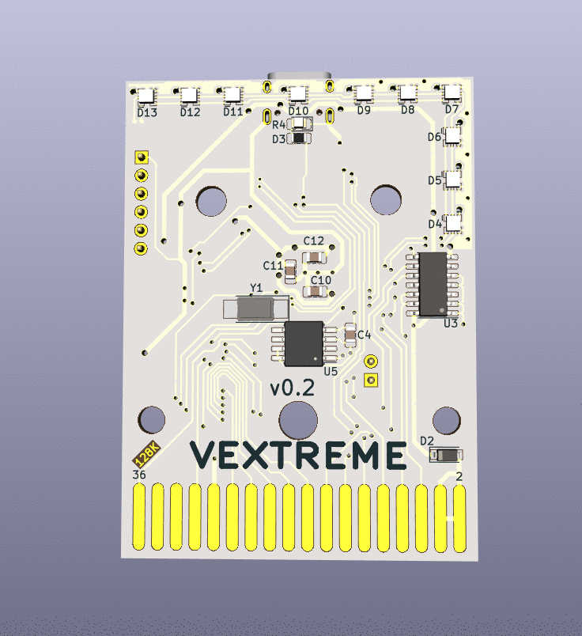

VEXTREME Vectrex Multicart
===

We're carrying on and pushing forward the amazing work of [Sprite_tm](http://spritesmods.com/?art=veccart&page=1) and his Extreme Vectrex Multicart. He posted the code (GPLv3 License) and lots of screens of the PCB/initial schematic, but he never released the PCB. It's a great base for an inexpensive and open multicart, for developers and players alike!

:warning: Please read this NOTICE of Current Development :warning:
===

**This project is a work in progress, and is not ready for mass production.**  Please observe the currently [posted issues](https://github.com/technobly/vextreme/issues) and there may be more lurking that are not yet identified.  The hardware and software is evolving.  You are free to build any version, contribute and/or follow along.  Please note that support of these pre-releases will be very limited and if you embark on an epic adventure to build one or a few, you should feel comfortable with this type of embedded hardware and software development.  There will be road bumps, but the journey is half the fun of the destination.  When things appear to be stable and we've worked out most of the kinks, we'll change the version to v1.0.  Only then is it advisable to mass produce.

3D Renders
===



Video Updates
===

Be sure to subscribe to my Youtube channel for updates!  Here's my [Vectrex playlist](https://www.youtube.com/watch?v=zkJ-z77fJCw&list=PL7MgXfpGKg6CCaIQejZVb5CsTg3-5mHU0&index=1) if you want to stay laser focused on this project.

VEXTREME Discord Server
===
Join the [VEXTREME Discord server](https://discord.gg/VDssGVJ) to chat with us about the development

BOM and Parts ordering
===

All the parts are described in [veccart.csv](bom/veccart.csv)

Also, you can use this [Digi-Key shared cart](https://www.digikey.com/short/zpdmtp) if you're in a hurry.  It has will have part references right on the packages for you!

Ordering PCB's
===

OSHPark is a good place to order with purple or the new "after dark" theme color scheme.  You can upload the KiCad [veccart.kicad_pcb](hardware/veccart.kicad_pcb) there directly.  I would download this entire Github repo ZIP file first though instead of just trying to save the PCB file from your browser.

Another way to order PCB's is by using the included [gerbers](hardware/gerbers) and uploading those with all of the necessary specs to companies like [PCBWay](https://www.pcbway.com) or [JLCPCB](https://jlcpcb.com)

Building and Flashing STM firmware
===

### This assumes you have these prerequisits installed:

- Docker
- dfu-util v0.9
- Make
- Windows will also require these [Zadig instructions](https://github.com/profezzorn/ProffieOS/wiki/zadig)

### Build the stm32-build docker image
```
code/veccart $ make docker-build
```

### Connect the 2-pin jumper and then connect the cart to USB

### Check if your computer sees the STM32
```
$ dfu-util -l

dfu-util 0.9

Copyright 2005-2009 Weston Schmidt, Harald Welte and OpenMoko Inc.
Copyright 2010-2019 Tormod Volden and Stefan Schmidt
This program is Free Software and has ABSOLUTELY NO WARRANTY
Please report bugs to http://sourceforge.net/p/dfu-util/tickets/

Deducing device DFU version from functional descriptor length
Found DFU: [0483:df11] ver=2200, devnum=22, cfg=1, intf=0, path="20-1.4.3", alt=3, name="@Device Feature/0xFFFF0000/01*004 e", serial="123412341234"
Found DFU: [0483:df11] ver=2200, devnum=22, cfg=1, intf=0, path="20-1.4.3", alt=2, name="@OTP Memory /0x1FFF7800/01*512 e,01*016 e", serial="123412341234"
Found DFU: [0483:df11] ver=2200, devnum=22, cfg=1, intf=0, path="20-1.4.3", alt=1, name="@Option Bytes  /0x1FFFC000/01*016 e", serial="123412341234"
Found DFU: [0483:df11] ver=2200, devnum=22, cfg=1, intf=0, path="20-1.4.3", alt=0, name="@Internal Flash  /0x08000000/04*016Kg,01*064Kg,03*128Kg", serial="123412341234"
```

### Build and flash the STM32 image via dfu-util
```
code/veccart $ make clean all flash

// You should end up with something like this

Downloading to address = 0x08000000, size = 23536
Download    [=========================] 100%        23536 bytes
Download done.
File downloaded successfully
```

### Remove the cart from USB and remove the jumper (install it on one pin so you don't lose it)


Building and Flashing the multicart's menu
===

### Build the asm6809 docker image
```
code/multicart $ make docker-build
```

### Connect the cart to USB with the 2-pin jumper removed

- The first time you do this you will likely have to format the USB drive

  - Name: VEXTREME
  - Format: MS-DOS (FAT)
  - Scheme: Master Boot Record

- Be patient, it's slow!  Don't worry, copying binaries later will be fast!!

### Build and flash the multicart menu binary
```
// Mac OS
code/multicart $ make clean all && cp multicart.bin /Volumes/VEXTREME/

// optionally add this to the above command to unmount, after you figure out which drive it is
$ diskutil list
&& diskutil unmountDisk /dev/disk3

// Linux
code/multicart $ make copy

// You should end up with something like this, and the binary should have been copied to the root of your multicart drive

asm6809  -B -o multicart.bin multicart.asm
```

Adding Vectrex Game ROMs (Binaries)
===

- Create a directory on your multicart called `roms/`

- Add your first binaries there, may I suggest: [Beluga Dreams](https://8-bit-waves.itch.io/beluga-dreams) and [Vec-Man](http://eiti.fh-pforzheim.de/personen/johannsen/projektlabor/vectrex_2019/vectrex_game_vec_man.htm) ?

Docs
===

A nice collection of lessons learned will be [documented here.](docs/)


Hall of Fame
===

If you build one of these, be sure to send me a message with your build pics showing your working VEXTREME multicart!  Or better yet, check out the [hall of fame format here](hall-of-fame/) and submit a PR (please and thank you!)

LICENSE
===

GPLv3 - essentially you must keep this open, all changes must be disclosed and shared.  Full [LICENSE here](LICENSE) and [TL;DR summary here](https://tldrlegal.com/license/gnu-general-public-license-v3-(gpl-3))
